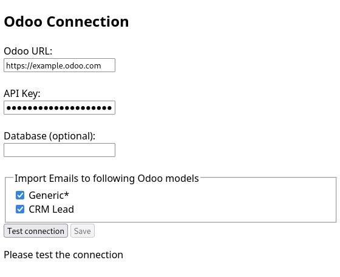

# Odoo Email Importer

This Thunderbird Plugin allows to export email from Thunderbird an into the ERP software [Odoo](https://www.odoo.com).

## Requirements

* odoo >= 19 (as the [External JSON-2 API](https://www.odoo.com/documentation/19.0/developer/reference/external_api.html) have been introduced in Odoo 19)
* Optional:
  * [mail_manual_routing](https://apps.odoo.com/apps/modules/19.0/mail_manual_routing) to handle new and unrelated emails, that are otherwise not visible/lost in Odoo. For details, see [faotools mail_manual_routing](https://faotools.com/apps/19.0/lost-messages-routing-19-0-mail-manual-routing-1037)
    * Without this extension, emails imported as *Generic* may not be visible for you. However, you can still import them as *Lead*. Make sure to active Leads in Odoo by:
      * *Settings -> General Settings -> CRM -> Leads*

## Setup

* Odoo:
  * for importing emails as leads, activate *Settings -> General Settings -> CRM -> Leads*
  * get an API key (*User -> My Preferences -> Security -> API Keys -> Add API key*, see [Odoo documentation](https://www.odoo.com/documentation/19.0/developer/reference/external_api.html#configuration))
* Thunderbird:
  * Install the addon [Odoo Email Importer](https://addons.thunderbird.net/thunderbird/addon/odoo-email-importer/) (this addon)
  * Configure *Odoo Email Importer*:
    * Set **Odoo URL** to your Odoo server.
    * Set the generated API Key into the **API Key** field.
    * Set the **Odoo database**, if it is required (normally it is not required)
    * Select the **Odoo Models** you want to import emails into. For testing, best start with *CRM Lead* (make sure to activate CRM Leads as described above).
    * Thunderbird addon *Odoo Email Importer* options window:
      
  * Test the settings by *Test connection*. If successful, *Save* them afterwards.

## Usage

After configuring the *Odoo Email Importer* addon, you can import emails to your Odoo server by its context menu. Right-click on the email and select *Import Email into Odoo* or its sub-entries.
